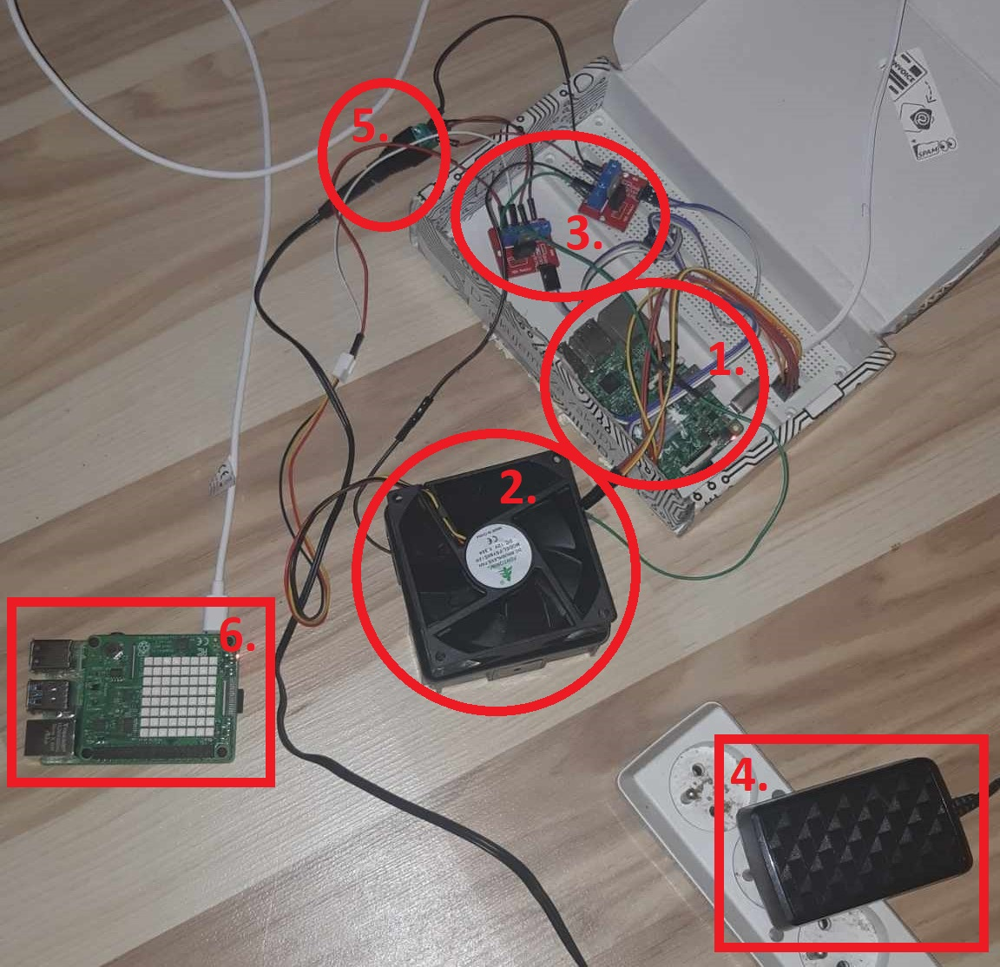
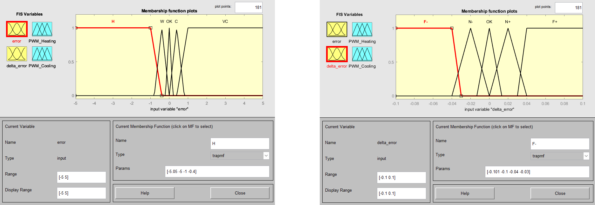
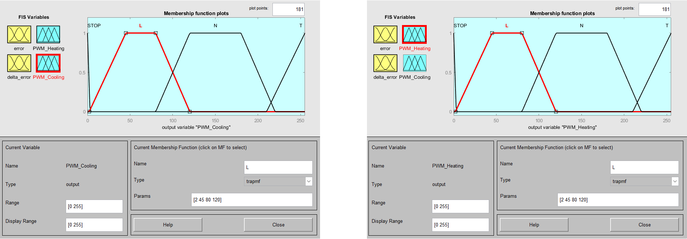
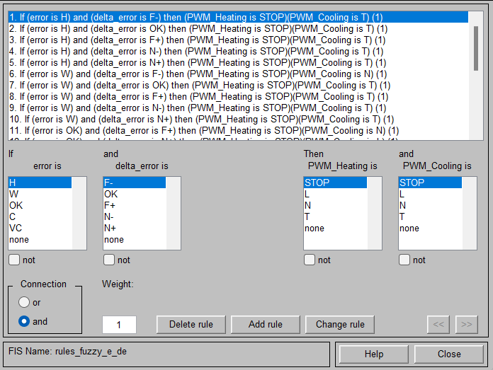
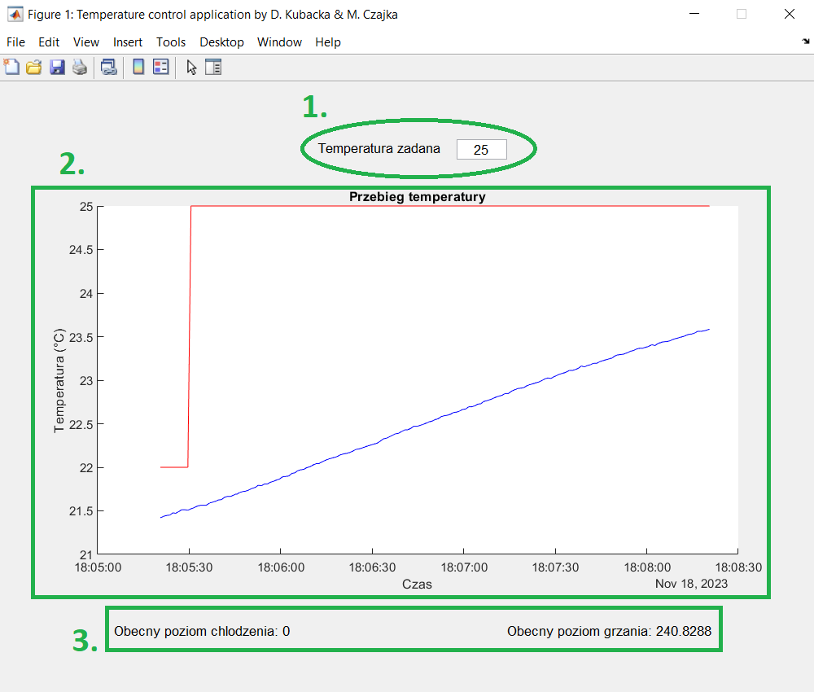
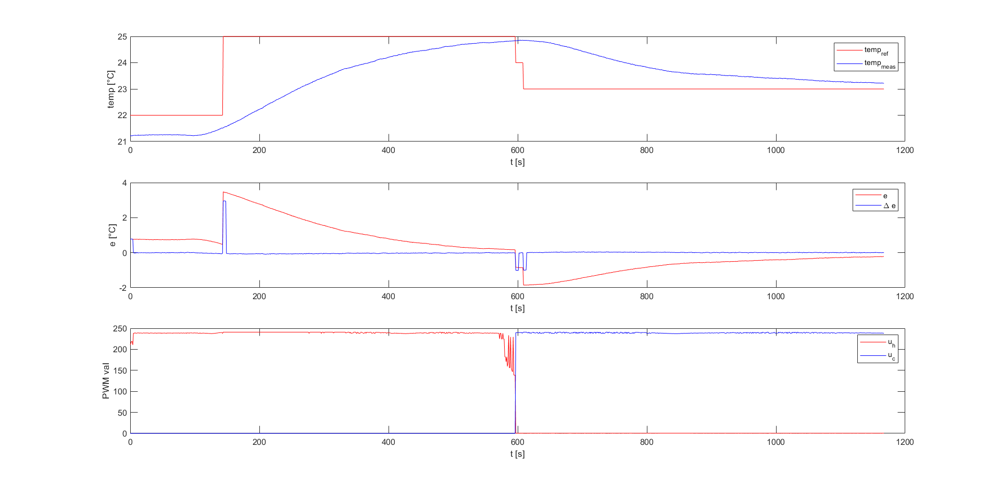

# Temperature control using Fuzzy Logic on Raspberry PI (with MQTT)

Project prepared with [@mmcza](https://www.github.com/mmcza).

# System

1. Raspberry PI model 3B - running the controller
2. Box with a resistor and temperature sensor inside and fan outside of it
3. IRF520 Transistor
4. AC adapter
5. Connector
6. Raspberry PI model 4 - MQTT broker

In the project, we implemented a Mamdani-type fuzzy controller. We opted to utilize error and the rate of change of error (delta error) as inputs, while the duty cycle of PWM for both heating and cooling served as outputs.

1.Input for reference value of temperature
2.Temperature graph display
3.Current PWM duty cycle information for Heating and Cooling, ranging from 0 to 255.

## Results

